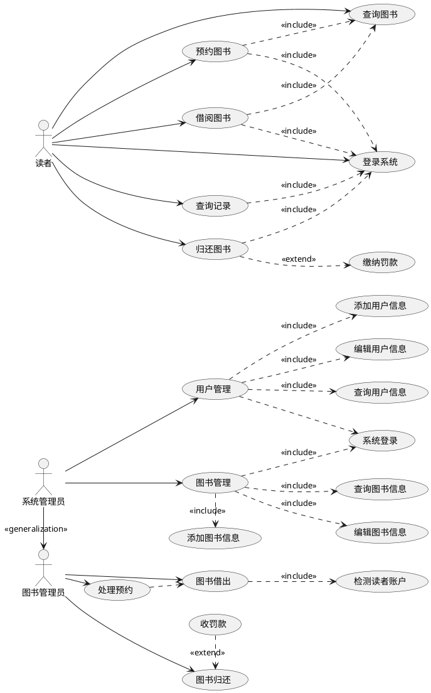
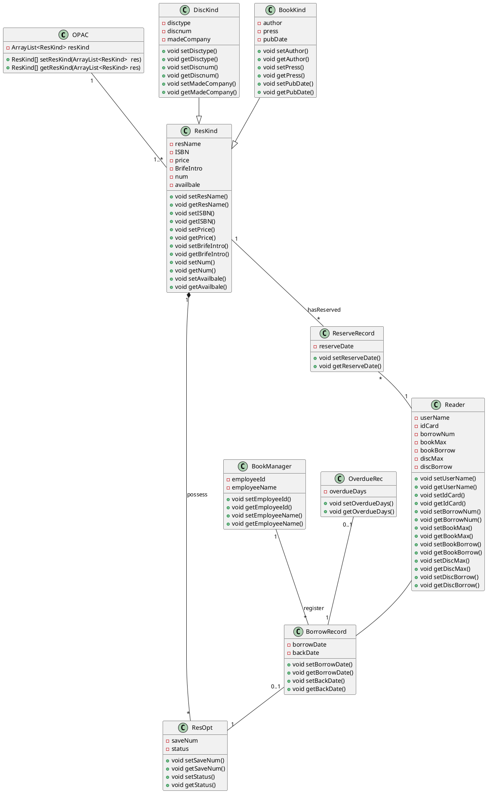

# 实验5：图书管理系统数据库设计与界面设计

| 学号         | 班级         | 姓名   |
| ------------ | ------------ | ------ |
| 201710414123 | 软件(本)17-1 | 许瑞峰 |

## 1.数据库表设计

## 1.1. 馆藏资源品种表（ResKind）
|字段|类型|主键，外键|可以为空|默认值|约束|说明|
|:-------:|:-------------:|:------:|:----:|:---:|:----:|:-----|
|ISBN|varchar(100)|主键，外键|否| |主键约束，外键约束|唯一标识非空列|
|resName|varchar(100)|外键 |否| |外键约束| 联合外键|
|price|double(10)| |否||||
|BrifeIntro|varchar(100)| |否||||
|num|int(10)| |否||||
|availbale|int(10)| |否||||

## 1.2. 图书品种表（BookKind）
|字段|类型|主键，外键|可以为空|默认值|约束|说明|
|:-------:|:-------------:|:------:|:----:|:---:|:----:|:-----|
|author|varchar(100)|主键，外键|否| |主键约束，外键约束|唯一标识非空列|
|press|varchar(100)| |否|| ||
|pubDate|varchar(100)| |否||||

## 1.3. 碟片品种表（DiscKind）
|字段|类型|主键，外键|可以为空|默认值|约束|说明|
|:-------:|:-------------:|:------:|:----:|:---:|:----:|:-----|
|disctype|varchar(100)|主键，外键|否| |主键约束，外键约束|唯一标识非空列|
|discnum|int(10)| |否|| ||
|madeCompany|varchar(100)| |否||||
## 1.4. 预定记录表（ReserveRecord）
|字段|类型|主键，外键|可以为空|默认值|约束|说明|
|:-------:|:-------------:|:------:|:----:|:---:|:----:|:-----|
|reserveDate|varchar(100)|  |否| | | |
|idCard|varchar(100)| 主键，外键|否| |主键约束，外键约束|唯一标识非空列|
|ISBN|varchar(100)|主键，外键|否| |主键约束，外键约束|联合主键，联合外键|
因为与馆藏资源品种表和读者表是多对一的关系，所以需要把另外两张表的主键添加进来作为其属性。
## 1.5. 读者表（Reader）
|字段|类型|主键，外键|可以为空|默认值|约束|说明|
|:-------:|:-------------:|:------:|:----:|:---:|:----:|:-----|
|userName|varchar(100)|主键，外键|否| |主键约束，外键约束|唯一标识非空列|
|idCard|varchar(100)| 主键，外键|否| | 主键约束，外键约束|联合主键，联合外键|
|borrowNum|int(10)| |否||||
|bookMax|int(10)| |否|| ||
|bookBorrow|int(10)| |否||||
|discMax|int(10)| |否|| ||
|discBorrow|int(10)| |否||||
## 1.6. 借书记录表（BorrowRecord）
|字段|类型|主键，外键|可以为空|默认值|约束|说明|
|:-------:|:-------------:|:------:|:----:|:---:|:----:|:-----|
|borrowDate|varchar(100)| ||否| |检查约束||
|backDate|varchar(100)| ||否| |检查约束||
|employeeId|varchar(100)|主键，外键|否| |主键约束，外键约束|唯一标识非空列|
该表与图书管理员表是多对一的关系，所以将图书管理员表的主键作为属性添加进来。
## 1.7. 资源项表（ResOpt）
|字段|类型|主键，外键|可以为空|默认值|约束|说明|
|:-------:|:-------------:|:------:|:----:|:---:|:----:|:-----|
|saveNum|int(10)| |否| | ||
|status|varchar(100)|  |否| | ||
|ISBN|varchar(100)|主键，外键|否| |主键约束，外键约束|唯一标识非空列|
该表与馆藏资源品种表是多对一的关系，所以将馆藏资源品种表的主键作为属性添加进来。
## 1.8. 图书管理员表（BookManager）
|字段|类型|主键，外键|可以为空|默认值|约束|说明|
|:-------:|:-------------:|:------:|:----:|:---:|:----:|:-----|
|employeeId|varchar(100)|主键，外键|否| |主键约束，外键约束|唯一标识非空列|
|employeeName|varchar(100)| 主键|否| |主键约束|联合主键|
## 1.9. 逾期记录表（OverdueRec）
|字段|类型|主键，外键|可以为空|默认值|约束|说明|
|:-------:|:-------------:|:------:|:----:|:---:|:----:|:-----|
|overdueDays|varchar(100)|主键，外键|否| |主键约束，外键约束|唯一标识非空列|
|fineNum|double(10)|主键，外键|否| |主键约束，外键约束|联合主键，联合外键|
该表与罚款细则表是多对一的关系，所以把罚款细则表的主键属性添加进来。
## 1.10. 罚款细则表（FineDetails）
|字段|类型|主键，外键|可以为空|默认值|约束|说明|
|:-------:|:-------------:|:------:|:----:|:---:|:----:|:-----|
|fineNum|double(10)|主键，外键|否| |主键约束，外键约束|唯一标识非空列|

## 2. 界面设计

## 2.1. 借书界面设计


***

|数据项名称|输入方式|长度|必填/可选|备注|
|:-------:|:-------------: | :----------:|:----------:|:----------:|
|读者卡号 | 手工输入或自动读取IC卡 | 8|必输 |人工录人必须为8位数字 |
|读者姓名 | 系统提取 | 20|必输 |系统通过读者卡号从数据库中获取 |
|联系电话 | 系统提取 | 20|必输 |系统通过读者卡号从数据库中获取 |
|联系地址 | 系统提取 | 30|必输 |系统通过读者卡号从数据库中获取 |
|馆藏号 | 自动条码识别 | 10|必输 |人工录人必须为10位数字 |
|资源类别 | 系统提取 | 2|必输 |系统通过图书馆藏号从数据库中提取 |
|名称 | 系统提取 |30|必输 |系统通过图书馆藏号从数据库中提取 |
|本次借书列表 | 自动加入 |  |必输 |表格，3列（图书馆藏号、书名、当前日期） |

用户界面的事件说明事件响应：

|事件|响应|
|:-------:|:-------------: |
| 单击查询按钮|  系统根据输入的读者卡号查询数据库获取读者信息并显示，当读者卡号为空时提示用户输人|
|完成图书条码阅读 | 系统根据图书条码查询数据库获取图书信息并显示|
|单击增加按钮 | 将当前显示的图书加人借书列表，如果读者额度已满，系统弹出提示框 |
|单击完成按钮 |弹出借书单打印窗口  |
- 用例图：借书用例



- 类图参见：借书类，读者类



- 顺序图：借书顺序图
````puml
@startuml
skinparam sequenceParticipant underline
actor "：Librarian"
activate "：Librarian"

"：Librarian" ->"：Reader":verifyReaders()
activate "：Reader"
deactivate "：Reader"
"：Librarian" ->"：Reader":getInformation()

activate "：Reader"
deactivate "：Reader"
"：Librarian" ->"：Resource":getResource()
activate "：Resource"
"：Resource" -> "：Collection":queryResKinds()
activate "：Collection"
deactivate "：Collection"
deactivate "：Resource"

"：Librarian" ->"：BorrowRecord":creaLendRecords()
activate "：BorrowRecord"
deactivate "：BorrowRecord"
"：Librarian" ->"：Resource":lendResource()
activate "：Resource"

"：Resource" ->"：Collection":reduceBorrNum()
activate "：Collection"
deactivate "：Collection"
deactivate "：Resource"
"：Librarian" ->"：Reader":reduceMaxLend()
activate "：Reader"
deactivate "：Reader"

"：Librarian"->"：BorrowRecord":printlendList()
activate "：BorrowRecord"
deactivate "：BorrowRecord"
deactivate "：Librarian"
@enduml

````


- API接口如下：

1. 用于获取读者信息和资源信息、本次借书列表的API
- 功能：用于获取读者信息和资源信息、本次借书列表
- 请求地址： http://example.com/v1/api/borrowBooks
- 请求方法：POST
- 请求参数：
|参数名称|必填|说明|
|:-------:|:-------------: | :----------:|
|access_token|是|用于验证请求合法性的认证信息 |
|method|是|固定为 “GET”|
- 返回实例：
```
{

   "uerInfo_url": "http://example.com/user/userInfo",
  "resourcesInfo_url": "http://example.com/resourcesInfo",
  "borrowList_url": "http://example.com/users/borrowList",
}
"code": 200
}
```
- 返回参数说明：
  
|参数名称|说明|
|:-------:|:-------------: |
|link|所有可用API列表|
|code|返回码|


2.读者信息API
- 功能：用于获取全部分类
- 请求地址： http://example.com/user/userInfo
- 请求方法：POST
- 请求参数：

|参数名称|必填|说明|
|:-------:|:-------------: | :----------:|
|access_token|是|用于验证请求合法性的认证信息 |
|method|是|固定为 “GET”|

- 返回实例：
```
{
    "info": "感谢您的阅读。",
    "data": {
        "idCard": "201710414126",
        "userName": "ZJ",
        "tel": "199****2558",
        "address": "四川成都",
    },
    "code": 200
}
```
- 返回参数说明：
  
|参数名称|说明|
|:-------:|:-------------: |
|Info|返回提示信息|
|data|用户的个人信息(读者卡号，读者姓名，联系电话，联系地址)|
|code|返回码|

3. 资源信息API
- 功能：用于获取全部分类
- 请求地址： http://example.com/resourcesInfo
- 请求方法：POST
- 请求参数：

|参数名称|必填|说明|
|:-------:|:-------------: | :----------:|
|access_token|是|用于验证请求合法性的认证信息。 |
|method|是|固定为 “GET”。|

- 返回实例：
```
{
    "info": "感谢您的访问。",
    "data": {
        "saveNum": "521",
        "resKind": "love",
        "resName": "rose",
    },
    "code": 200
}
```
- 返回参数说明：
  
|参数名称|说明|
|:-------:|:-------------: |
|Info|返回信息|
|data|馆藏资源信息(馆藏号，资源类别，名称)|
|dodo|返回码|

4. 本次借书列表API
- 功能：用于获取全部分类
- 请求地址： http://example.com/users/borrowList
- 请求方法：POST
- 请求参数：

|参数名称|必填|说明|
|:-------:|:-------------: | :----------:|
|access_token|是|用于验证请求合法性的认证信息。 |
|method|是|固定为 “GET”。|

- 返回实例：
```
{

    "data": {
        "bookName": "水浒传"
        "author": "施耐庵",
        "pubDate": "2019-12-15",
        "bookName":"西游记"
        "author": "吴承恩",
        "pubDate": "2020-01-01",
    },
    "code": 200
}
```
- 返回参数说明：
  
|参数名称|说明|
|:-------:|:-------------: |
|data|借书列表信息|
|dodo|返回码|

github-pages链接：
