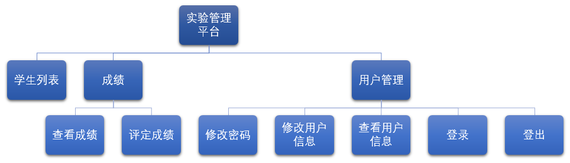
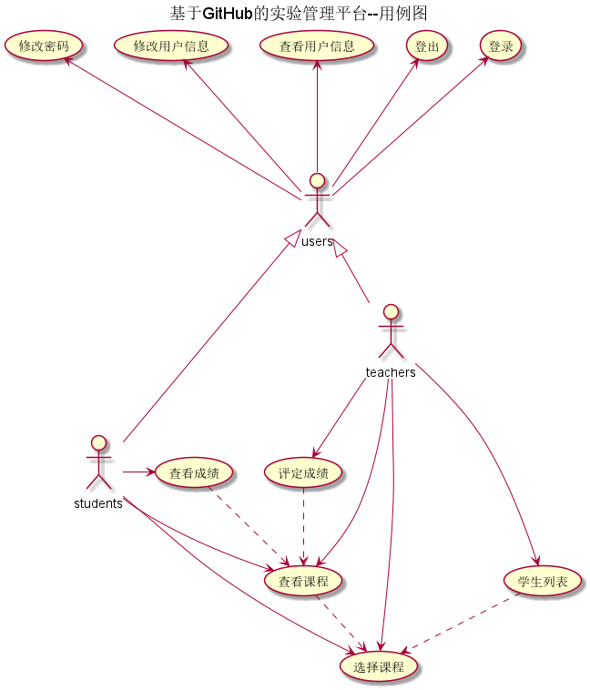
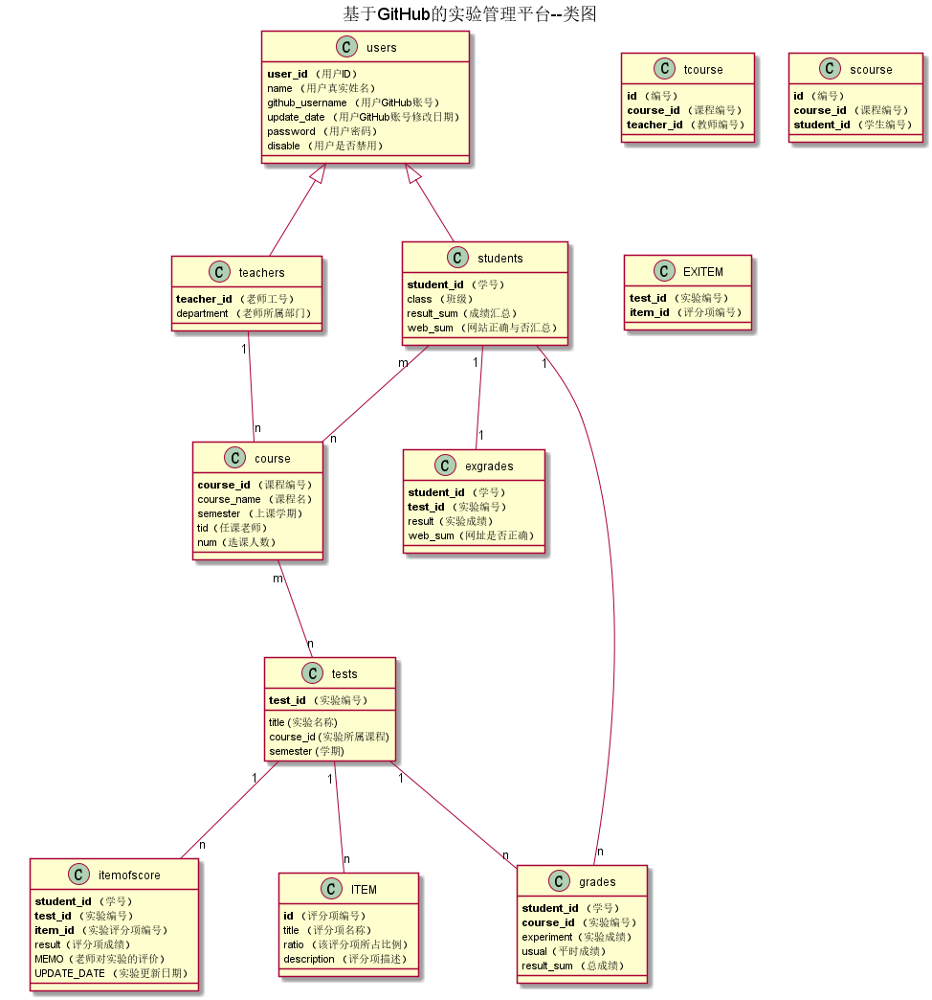
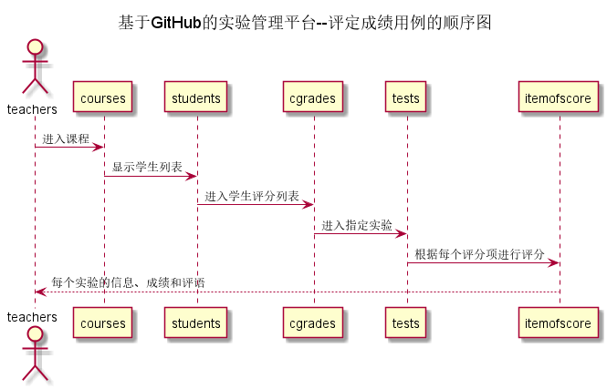
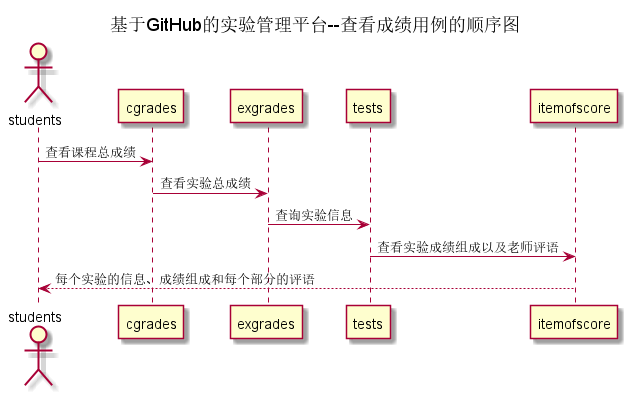

# 基于GitHub的实验管理平台的分析与设计

### 成都大学信息科学与工程学院

|学号|班级|姓名|
|:-------:|:-------------: | :----------:|
|201710414123|软件(本)17-1|许瑞峰|

## 1. 概述
- 基于GitHub的实验管理平台的作用是在线管理实验成绩的Web应用系统。学生和老师的实验内容均存放在GitHUB页面上。
- 学生的功能主要有：一是设置自己的GitHub用户名，二是查询自己的实验成绩。学生的GitHub用户名是公开的，但成绩不公开。
- 老师的功能主要有：一是批改每个学生的成绩，二是查看每个学生的成绩。
- 老师和学生都能通过本系统的链接方便地跳转到学生的每个GitHUB实验目录，以便批改实验或者查看实验情况。
- 实验成绩按数字分数计算，每项实验的满分为100分，最低为0分。
- 系统自动计算每个学生的所有实验的平均分。
  
## 2. 系统总体结构

​    
## 3. 用例图设计 [源码](src/UseCase.puml)

## 4. 类图设计 [源码](src/class.puml)

## 5. 数据库设计

- ## USERS表（用户表）

|      字段       |        类型        | 主键，外键 | 可以为空 | 默认值 | 约束 | 说明                                  |
| :-------------: | :----------------: | :--------: | :------: | :----: | :--: | :------------------------------------ |
|     USER_ID     |    NUMBER(8,0)     |    主键    |    否    |        |      | 用户ID                                |
|      NAME       | VARCHAR2(50 BYTE)  |            |    否    |        |      | 用户真实姓名                          |
| GITHUB_USERNAME | VARCHAR2(50 BYTE)  |            |    是    |   空   |      | GitHUB用户名                          |
|   UPDATE_DATE   |        DATE        |            |    是    |   空   |      | GitHUB用户名修改日期                  |
|    PASSWORD     | VARCHAR2(512 BYTE) |            |    是    |   空   |      | 加密存储密码，为空表示密码就是学号    |
|     DISABLE     | VARCHAR2(20 BYTE)  |            |    否    |        |      | 是否禁用,值为是表示禁用,其他表示正常. |

- ## TEACHERS表（老师表）

|    字段    |        类型        | 主键，外键 | 可以为空 | 默认值 | 约束 | 说明                        |
| :--------: | :----------------: | :--------: | :------: | :----: | :--: | :-------------------------- |
| TEACHER_ID | VARCHAR2(50 BYTE)  |    主键    |    否    |        |      | 老师的编号                  |
|  USER_ID   |    NUMBER(8,0)     |    外键    |    是    |        |      | 老师的用户ID，USERS表的外键 |
| DEPARTMENT | VARCHAR2(400 BYTE) |            |    否    |        |      | 老师属于的部门              |

- ## STUDENTS表（学生表）

|    字段    |        类型        | 主键，外键 | 可以为空 | 默认值 | 约束 | 说明                                                  |
| :--------: | :----------------: | :--------: | :------: | :----: | :--: | :---------------------------------------------------- |
| STUDENT_ID | VARCHAR2(50 BYTE)  |    主键    |    否    |        |      | 学生的学号                                            |
|  USER_ID   |    NUMBER(8,0)     |    外键    |    是    |        |  空  | 学生的用户ID，USERS表的外键，为空表示还没有建立用户   |
|   MAJOR    | VARCHAR2(20 BYTE)  |            |    否    |        |      | 学生的专业                                            |
|  CLASSNUM  | VARCHAR2(20 BYTE)  |            |    否    |        |      | 学生的班级号                                          |
| RESULT_SUM | VARCHAR2(400 BYTE) |    外键    |    是    |   空   |      | 成绩汇总（来自CGRADES表，系统自动计算所有课程平均分） |

- ## CGRADES表（学生课程成绩表）

|    字段    |        类型        |   主键，外键    | 可以为空 | 默认值 |   约束    | 说明                                         |
| :--------: | :----------------: | :-------------: | :------: | :----: | :-------: | :------------------------------------------- |
| STUDENT_ID | VARCHAR2(50 BYTE)  | 联合主键1，外键 |    否    |        |           | 学生的学号，STUDENTS表外键                   |
| course_id  | VARCHAR2(50 BYTE)  | 联合主键2，外键 |    否    |        |           | 实验编号，TESTS表的外键                      |
| experiment |       NUMBER       |                 |    是    |   0    | 取值0-100 | 学生实验成绩汇总                             |
|   usual    |       NUMBER       |                 |    是    |   0    | 取值0-100 | 学生平时成绩                                 |
| result_sum |       NUMBER       |                 |    是    |   0    | 取值0-100 | 学生成绩（系统自动计算汇总）                 |
|  WEB_SUM   | VARCHAR2(400 BYTE) |                 |    是    |   Y    |           | GitHub网址是否正确，Y代表正确，N代表不正确。 |

​    

- ## EXGRADES表（学生实验成绩表）

|    字段    |        类型        |   主键，外键    | 可以为空 | 默认值 |   约束    | 说明                                         |
| :--------: | :----------------: | :-------------: | :------: | :----: | :-------: | :------------------------------------------- |
| STUDENT_ID | VARCHAR2(50 BYTE)  | 联合主键1，外键 |    否    |        |           | 学生的学号，STUDENTS表外键                   |
|  TEST_ID   |    NUMBER(6,0)     | 联合主键2，外键 |    否    |        |           | 实验编号，TESTS表的外键                      |
|   RESULT   |       NUMBER       |      主键       |    是    |   空   | 取值0-100 | 分数（自动汇总评分项）                       |
|  WEB_SUM   | VARCHAR2(400 BYTE) |                 |    是    |   Y    |           | GitHub网址是否正确，Y代表正确，N代表不正确。 |

- ## ITEMOFSCORE表（实验评分项成绩表）

|    字段     |        类型        |   主键，外键    | 可以为空 | 默认值 |   约束    | 说明                               |
| :---------: | :----------------: | :-------------: | :------: | :----: | :-------: | :--------------------------------- |
| STUDENT_ID  | VARCHAR2(50 BYTE)  | 联合主键1，外键 |    否    |        |           | 学生的学号，STUDENTS表外键         |
|   TEST_ID   |    NUMBER(6,0)     | 联合主键2，外键 |    否    |        |           | 实验编号，TESTS表的外键            |
|   item_id   | VARCHAR2(50 BYTE)  | 联合主键3，外键 |    否    |        |           | 评分项id                           |
|   RESULT    |       NUMBER       |                 |    是    |   空   | 取值0-100 | 该评分项分数                       |
|    MEMO     | VARCHAR2(400 BYTE) |                 |    是    |   空   |           | 老师对实验的评语                   |
| UPDATE_DATE |        DATE        |                 |    是    |   空   |           | 老师批改实验的日期，为空表示未批改 |

- ## EXITEM表（实验评分项）

|  字段   |       类型        |    主键，外键     | 可以为空 | 默认值 | 约束 | 说明                    |
| :-----: | :---------------: | :---------------: | :------: | :----: | :--: | :---------------------- |
| TEST_ID |    NUMBER(6,0)    | 联合主键2，外键 ` |    否    |        |      | 实验编号，TESTS表的外键 |
| item_id | VARCHAR2(50 BYTE) |       外键        |    否    |        |      | 评分项id                |

- ## ITEM表（评分项分配）

|    字段     |        类型        |   主键，外键    | 可以为空 | 默认值 | 约束 | 说明             |
| :---------: | :----------------: | :-------------: | :------: | :----: | :--: | :--------------- |
|     id      | VARCHAR2(50 BYTE)  | 联合主键1，外键 |    否    |        |      | ID               |
|    title    | VARCHAR2(400 BYTE) |                 |    否    |        |      | 评分项名称       |
|    ratio    |     float(10)      |                 |    否    |        |      | 该项实验成绩占比 |
| description | VARCHAR2(400 BYTE) |                 |    否    |        |      | 评分要求描述     |

- ## TESTS表（实验项目表）

|   字段    |        类型        | 主键，外键 | 可以为空 | 默认值 | 约束 | 说明           |
| :-------: | :----------------: | :--------: | :------: | :----: | :--: | :------------- |
|  TEST_ID  |    NUMBER(6,0)     |    主键    |    否    |        |      | 实验编号       |
|   TITLE   | VARCHAR2(100 BYTE) |            |    否    |        |      | 实验名称       |
| course_id | VARCHAR2(50 BYTE)  |    外键    |          |        |      | 实验所属课程id |
| semester  | VARCHAR2(100 BYTE) |            |    否    |        |      | 实验的所属学期 |

- ## COURSE表（课程表）

|    字段     |        类型        | 主键，外键 | 可以为空 | 默认值 | 约束 | 说明         |
| :---------: | :----------------: | :--------- | :------: | :----: | :--: | :----------- |
|  course_id  |    NUMBER(6,0)     | 联合主键   |    否    |        |      | 课程编号     |
| course_name | VARCHAR2(100 BYTE) |            |    否    |        |      | 课程名       |
|     num     |    NUMBER(6,0)     |            |    否    |   0    |      | 学生选课人数 |
|  semester   | VARCHAR2(100 BYTE) |            |    否    |        |      | 上课的学期   |
|     tid     | VARCHAR2(100 BYTE) | 外键       |          |        |      | 选课老师id   |

- ## TCOURSE表（老师选择课程表）

|    字段    |       类型        | 主键，外键 | 可以为空 | 默认值 | 约束 | 说明             |
| :--------: | :---------------: | :--------: | :------: | :----: | :--: | :--------------- |
|     ID     |    NUMBER(6,0)    |  联合主键  |    否    |        |      | 编号             |
| teacher_id | VARCHAR2(50 BYTE) |  联合主键  |    否    |        |      | 老师的编号       |
| course_id  | VARCHAR2(50 BYTE) |  联合主键  |    否    |        |      | 老师选择课程编号 |

- ## SCOURSE表（学生选择课程表）

|    字段    |       类型        | 主键，外键 | 可以为空 | 默认值 | 约束 | 说明             |
| :--------: | :---------------: | :--------: | :------: | :----: | :--: | :--------------- |
|     ID     |    NUMBER(6,0)    |  联合主键  |    否    |        |      | 编号             |
| student_id | VARCHAR2(50 BYTE) |  联合主键  |    否    |        |      | 学生的学号       |
| course_id  | VARCHAR2(50 BYTE) |  联合主键  |    否    |        |      | 老师选择课程编号 |

## 6. 用例及界面详细设计
### “学生列表”用例

#### 1. 用例规约

| 用例名称   | 学生列表                                     |
| ---------- | :------------------------------------------- |
| 功能       | 以表形式的显示出所有学生的信息               |
| 参与者     | 老师                                         |
| 前置条件   | 老师需要先登录，需要选择当前学期以及课程信息 |
| 后置条件   |                                              |
| 主事件流   |                                              |
| 备选事件流 |                                              |

#### 2. 业务流程（顺序图） [源码](./src/sequence学生列表.puml)

#### 3. 界面设计

- API接口调用
  - 接口1：[getStudents](./接口/getStudents.md) 

#### 4. 算法描述

- WEB_SUM解析为列表  
  - WEB_SUM是接口getStudents的返回值中的一部分，形如："WEB_SUM": "Y"。需要在前端进行解析。  
  - 作用是判断GitHub网址是否正确，Y代表正确，N代表不正确。  
  - 当网址出现问题，可以通过点击实验详情，了解具体信息。

- result_sum解析为列表
  - result_sum是接口getStudents的返回值中的一部分，形如："result_sum": "100"。需要在前端进行解析。
  - 成绩汇总（来自CGRADES表），这是系统通过计算每个实验成绩以及平时成绩以一定的权重计算得来。

#### 5. 参照表

- [STUDENTS](./数据库设计.md/#STUDENTS)
- [CGRADES](./数据库设计.md/#CGRADES)
- [TESTS](./数据库设计.md/#TESTS)
- [COURSE](./数据库设计.md/#COURSE)
- [EXGRADES](./数据库设计.md/#EXGRADES)
- [ITEMOFSCORE](./数据库设计.md/#ITEMOFSCORE)

### “评定成绩”用例 

#### 1. 用例规约

| 用例名称   | 评定成绩                                                     |
| ---------- | :----------------------------------------------------------- |
| 功能       | 老师评定一个学生的实验成绩                                   |
| 参与者     | 老师                                                         |
| 前置条件   | 查看成绩：评定成绩之前，老师需要先登录，并选择相应的课程以及相应的实验，并显示出一个学生的所有实验成绩和评语信息 |
| 后置条件   | 评定成绩提交之后，系统自动设置成绩更新日期为当前日期，自动计算平均成绩 |
| 主事件流   | 1. 选择当前的课程   2.选择当前的实验    3.对每个评分项就行评分，并对每个评分项进行评语    4.提交   5. 系统存储实验成绩和评语  5. 系统自动计算实验成绩，并将分数汇总到课程总成绩 |
| 备选事件流 | 2a. 成绩必须是0至100之间，可以为空，但不能超界  &nbsp;&nbsp; 1.提示用户重新输入成绩分数 |

#### 2. 业务流程（顺序图） [源码](./src/sequence评定成绩.puml)

 

#### 3. 界面设计

- 界面参照: ./评定成绩.html

- API接口调用

  - 接口1：[getNextPrevStudent](./接口/getNextPrevStudent.md)

    用于取得上一个或者下一个学生的学号

  - 接口2：[getOneStudentResults](./接口/getOneStudentResults.md)

    用于显示一个学生的所有实验成绩和评语

  - 接口3：[setOneStudentResults](./接口/setOneStudentResults.md)

    用于设置一个学生的部分实验成绩和评语

    无

#### 5. 参照表

- [TEACHER](./数据库设计.md/#TEACHER)
- [GRADES](./数据库设计.md/#GRADES)
- [TESTS](./数据库设计.md/#TESTS)
- [COURSE](./数据库设计.md/#COURSE)
- [EXGRADES](./数据库设计.md/#EXGRADES)
- [ITEMOFSCORE](./数据库设计.md/#ITEMOFSCORE)

### “查看成绩”用例 

#### 1. 用例规约

| 用例名称   | 查看成绩                                       |
| ---------- | :--------------------------------------------- |
| 功能       | 学生查看自己的每个实验的实验成绩及实验成绩组成 |
| 参与者     | 学生                                           |
| 前置条件   | 学生需要先登录，需要选择当前课程以及当前学期   |
| 后置条件   |                                                |
| 主事件流   |                                                |
| 备选事件流 |                                                |

#### 2. 业务流程（顺序图） [源码](./src/sequence查看成绩.puml)

 

#### 3. 界面设计

- API接口调用
  - 接口1：[getOneStudentResults](./接口/getOneStudentResults.md) 

#### 4. 算法描述

    无

#### 5. 参照表

- [STUDENTS](./数据库设计.md/#STUDENTS)
- [GRADES](./数据库设计.md/#GRADES)
- [TESTS](./数据库设计.md/#TESTS)
- [COURSE](./数据库设计.md/#COURSE)
- [EXGRADES](./数据库设计.md/#EXGRADES)
- [ITEMOFSCORE](./数据库设计.md/#ITEMOFSCORE)

### “修改密码”用例

#### 1. 用例规约

| 用例名称   | 修改密码                                                     |
| ---------- | :----------------------------------------------------------- |
| 功能       | 修改用户的密码                                               |
| 参与者     | 学生，老师                                                   |
| 前置条件   | 必须先登录                                                   |
| 后置条件   | 修改密码以后必须强制登出，再跳转到登录页面                   |
| 主事件流   | 1.用户填写新密码（两次输入）   2.用户提交修改信息  3.系统存储修改后密码 |
| 备选事件流 | 1a. 用户两次输入的密码不同  &nbsp;&nbsp; 1.系统提示两次输入的密码不相同   &nbsp;&nbsp; 2. 用户重新填写并提交。 |

#### 2. 业务流程

无

## 3. 界面设计

- API接口调用
  - 接口1：[setPassword](./接口/setPassword.md)

#### 4. 算法描述 [源码](./src/登录认证流程图.puml)

    

#### 5. 参照表

users

- [USERS](./数据库设计.md/#USERS)

### “修改用户信息”用例

#### 1. 用例规约

| 用例名称   | 修改用户信息                                                 |
| ---------- | :----------------------------------------------------------- |
| 功能       | 修改用户的GitHub用户名称                                     |
| 参与者     | 学生，老师                                                   |
| 前置条件   | 必须先登录，并且查看用户现有的GitHub用户名                   |
| 后置条件   |                                                              |
| 主事件流   | 1.用户填写GitHub用户名称   2.用户提交修改信息  3.系统存储修改后的GitHub用户名称 |
| 备选事件流 | 1a. 如果用户输入的GitHub用户名称为空  &nbsp;&nbsp; 1.系统清空用户的GitHub用户名称 |

#### 2. 业务流程

无

#### 3. 界面设计

- API接口调用
  - 接口1：[getUserInfo](./接口/getUserInfo.md)
  - 接口2：[setUserInfo](./接口/setUserInfo.md)

#### 4. 算法描述

无
    

#### 5. 参照表

- [USERS](./数据库设计.md/#USERS)

### “查看用户信息”用例

#### 1. 用例规约

| 用例名称   | 查看用户信息       |
| ---------- | :----------------- |
| 功能       | 查看用户的所有信息 |
| 参与者     | 学生，老师         |
| 前置条件   | 必须先登录         |
| 后置条件   |                    |
| 主事件流   |                    |
| 备选事件流 |                    |

#### 2. 业务流程

无

#### 3. 界面设计

- API接口调用
  - 接口1：[getUserInfo](./接口/getUserInfo.md)

#### 4. 算法描述

无
    

#### 5. 参照表

- [STUDENTS](./数据库设计.md/#STUDENTS)
- [TEACHERS](./数据库设计.md/#TEACHERS)
- [USERS](./数据库设计.md/#USERS)

### “登出”用例 

#### 1. 用例规约

| 用例名称   | 登出                                                         |
| ---------- | :----------------------------------------------------------- |
| 功能       | 用户登出平台                                                 |
| 参与者     | 学生/老师                                                    |
| 前置条件   |                                                              |
| 后置条件   | 登出后，跳转到登录页面                                       |
| 主事件流   | 1. 系统清除客户端登录信息（Cookie）                          |
| 备选事件流 | 1a. 如果用户登录之后，长时间不超作界面，导致Cookie失效  &nbsp;&nbsp; 1.系统清除客户端登录信息（Cookie |

#### 2. 业务流程

无

#### 3. 界面设计

- API接口调用
  - 接口1：[logout](./接口/logout.md)

#### 4. 算法描述

#### 5. 参照表

- [USERS](./数据库设计.md/#USERS)

### “登录”用例

#### 1. 用例规约

| 用例名称   | 登录                                                         |
| ---------- | :----------------------------------------------------------- |
| 功能       | 登录平台                                                     |
| 参与者     | 访客                                                         |
| 前置条件   |                                                              |
| 后置条件   | 登录成功后，跳转到主页                                       |
| 主事件流   | 1. 访客输入用户名和密码，选择用户类型 2.系统判断用户名，密码，用户类正确，允许登录 3.系统在客户端以Cookie形式存储登录用户信息，保持登录的持久性。 |
| 备选事件流 | 1a. 输入的用户名或者密码为空  &nbsp;&nbsp; 1.提示重新输入   &nbsp;&nbsp; 2.访客重新提交登录信息  2a.系统判断用户名，密码，用户类不正确，不允许登录  &nbsp;&nbsp; 1.提示重新输入   &nbsp;&nbsp; 2.访客重新提交登录信息 |

#### 2. 业务流程

无

#### 3. 界面设计

- API接口调用
  - 接口1：[login](./接口/login.md)

#### 4. 算法描述 [源码](./src/登录认证流程图.puml)

    

#### 5. 参照表

- [USERS](./数据库设计.md/#USERS)
